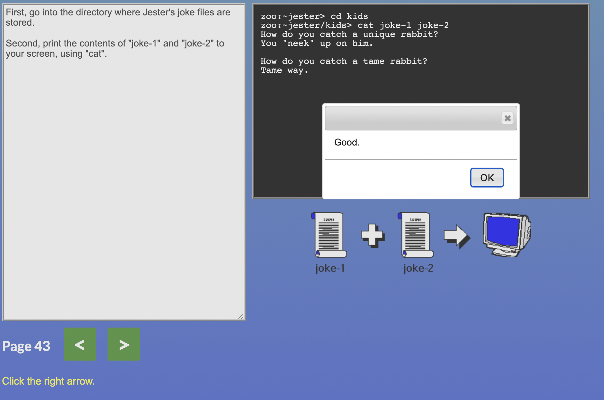
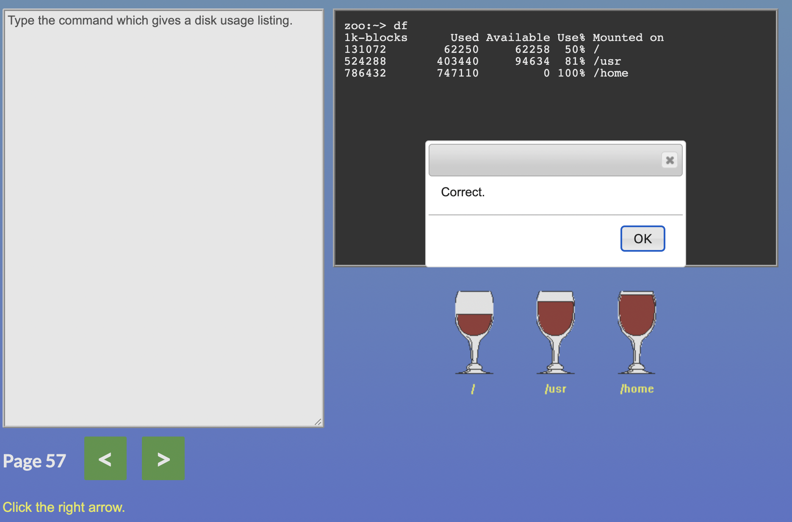

# kottans-frontend
Git lessons
this is an incredible course. I started from scratch and have already learned a lot

## Responsive Web Design
I really liked the games. While passing the levels, you get a practical understanding of the passed material.

## Intro to HTML and CSS

Intro to HTML and CSS

## Git Collaboration
The problem remains that after completing a task in the learning environment, it is difficult to fully understand how it will be directly in GitHub

Git Collaboration

## Linux CLI, and HTTP
<h1>
Considering that this is the first time for me, and the reasoning for each task is the same - it's all new))). Time will tell what I will use in the future.
</h1>

TASK1

TASK5

TASK7

TASK8

TASK9

TASK10

TASK12

TASK13

TASK14

TASK17

TASK19

TASK20

TASK21

TASK22

TASK27

TASK28

TASK30

TASK31

TASK36

TASK37

TASK38

TASK39

TASK41

TASK43

TASK45

TASK47

TASK49

TASK50

TASK51

TASK54

TASK57

TASK58

TASK59

TASK61

TASK64

TASK65

TASK66

TASK67

TASK68

TASK69

